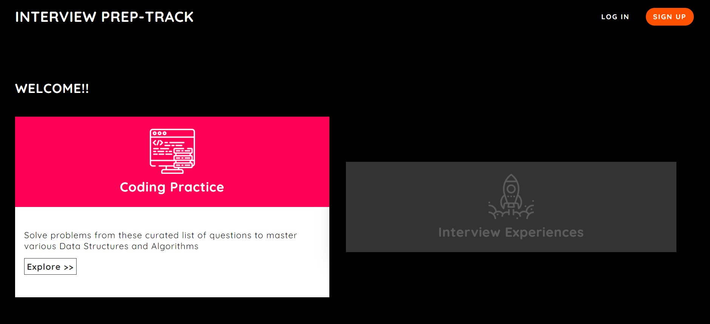

 

    
  

  <h3 align="center">Interview Prep-Track</h3>

  

    A website to get started with your interview practice
     
     
  

<!-- TABLE OF CONTENTS -->

  
<h2 style="display: inline-block">Table of Contents</h2>

  <ol>
    <li>
      <a href="#about-the-project">About The Project</a>
      <ul>
        <li><a href="#built-with">Built With</a></li>
      </ul>
    </li>
    <li><a href="#screenshots">Screenshots</a></li>
    <li><a href="#setup">Setup</a></li>
    <li><a href="#contact">Contact</a></li>
  </ol>

<!-- ABOUT THE PROJECT -->
## About The Project

Interview PrepTrack is community driven website for interview preparation, where students can practice various hand-picked questions from variety of listed topics or they can read about the interview experiences of past candidates.
The website is primarily based on NodeJs and MongoDB

### Built With

* NodeJs (express-ejs)
* MongoDB
* HTML,css
* Javascript
* jsonwebtokens,bcrypt - for authentication.
* adminbro - for admin panel

### Screenshots

### Setup 
Run the following commands locally: npm install, nodemon app  

### Contact

* Anuraag Mahajan 
* Email -  manuraag@iitg.ac.in

<!-- MARKDOWN LINKS & IMAGES -->
[product-screenshot]: images/home.jpg
